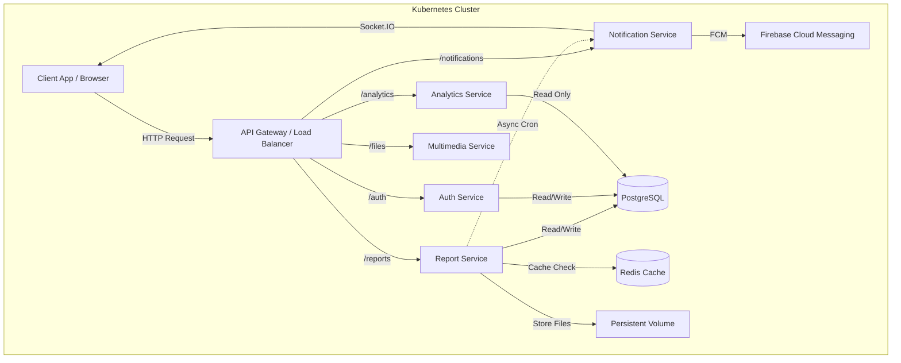

# Dokumen Perancangan Sistem
**Distributed Citizen Reporting System (Sistem Pelaporan Warga Terdistribusi)**

*(Silakan ganti gambar ini dengan gambar bebas/logo aplikasi)*

---

## 1. Identitas Kelompok

**Nama Kelompok**: [Isi Nama Kelompok]
**Aplikasi**: CitizenReport (Platform Laporan Warga Skala Kota)

### Anggota dan Kontribusi
| Nama Mahasiswa | NIM | Kontribusi Utama |
| :--- | :--- | :--- |
| [Nama Anggota 1] | [NIM] | System Architect, K8s Infrastructure, API Gateway |
| [Nama Anggota 2] | [NIM] | Backend (Report & Auth Service), DB Schema |
| [Nama Anggota 3] | [NIM] | Backend (Notification & Analytics), Redis Integration |
| [Nama Anggota 4] | [NIM] | Testing (E2E & Stress Test), Documentation |

---

## 2. Deskripsi Umum Sistem

Sistem ini dirancang untuk melayani kota dengan populasi **2.5 juta penduduk**, yang memungkinkan warga untuk melaporkan masalah infrastruktur, sosial, dan layanan publik secara real-time. Karena skala yang besar, sistem dibangun menggunakan arsitektur **Microservices** untuk menjamin skalabilitas, isolasi kegagalan, dan kemudahan pengembangan.

Sistem menangani alur dari pelaporan warga, verifikasi otomatis/manual, penerusan ke dinas terkait (Dinas Kebersihan, PU, dll), hingga notifikasi status penyelesaian kembali ke warga.

---

## 3. Arsitektur Sistem

Arsitektur sistem menggunakan pola Microservices dengan komunikasi via HTTP REST (Synchronous) dan Event-Based (Asynchronous via Outbox Pattern/Cron).

### Diagram Arsitektur

### Penjelasan Komponen
1.  **API Gateway (Nginx)**: Single entry point yang menangani routing, load balancing, dan termination SSL.
2.  **Auth Service**: Menangani pendaftaran, login, dan validasi JWT (RBAC). Menyimpan data user dan peran.
3.  **Report Service**: Core domain. Menangani CRUD laporan, filter isolasi departemen, dan privasi anonim. Menggunakan Redis untuk caching list laporan publik.
4.  **Notification Service**: Service independen untuk mengirim notifikasi real-time (Socket.IO) dan Push Notification (FCM).
5.  **Multimedia Service**: Menangani upload file fisik (gambar bukti laporan) ke storage terpisah.
6.  **Analytics Service**: Mengagregasi data untuk kebutuhan dashboard pimpinan.

---

## 4. Teknologi Terpilih

| Komponen | Teknologi | Alasan Pemilihan |
| :--- | :--- | :--- |
| **Runtime** | **Node.js (Express)** | I/O-bound performance yang sangat baik untuk handling ribuan concurrent requests dan koneksi WebSocket. Ekosistem library yang matang. |
| **Language** | **JavaScript** | Development speed cepat, memudahkan sharing logic (utility) antar service. |
| **Database** | **PostgreSQL** | Relational integrity sangat dibutuhkan untuk data laporan yang terstruktur dan berelasi kuat dengan User & Status. |
| **Caching** | **Redis** | In-memory key-value store tercepat untuk mengurangi load database pada endpoint high-traffic (`GET /reports`). |
| **Orchestration** | **Kubernetes (K8s)** | Manajemen container otomatis, scaling, dan self-healing yang krusial untuk production grade 2.5jt user. |
| **Gateway** | **Nginx** | Proven high-performance web server, efisien sebagai Reverse Proxy dan Static File server. |
| **Real-time** | **Socket.IO** | Abstraksi WebSocket yang reliable dengan fitur fallback dan room management (penting untuk notifikasi personal). |

---

## 5. Pemilihan Fungsionalitas & Kualitas (Proof-of-Concept)

Untuk PoC ini, kami memprioritaskan fungsionalitas dan kualitas yang paling menantang secara teknis dan kritikal bagi bisnis.

### A. Fungsionalitas Kritis
1.  **Department Isolation (Isolasi Data Dinas)**:
    *   *Alasan*: Fitur keamanan logis terpenting. Memastikan Dinas Kebersihan hanya melihat laporan sampah, bukan jalan rusak. Validasi arsitektur data.
2.  **Anonymous Reporting (Privasi Warga)**:
    *   *Alasan*: Kebutuhan legal/sosial. Mengharuskan logic masking yang ketat di level API/Query agar data pelapor tidak bocor ke publik namun tetap terlacak di sistem.
3.  **Real-time Status Updates**:
    *   *Alasan*: UX utama. Warga mengharapkan feedback instan. Menguji integrasi antar-service (Report -> Notif).

### B. Atribut Kualitas (Non-Functional)
1.  **Performance (Scalability)** -> **Redis Caching**:
    *   *Implementasi*: Cache-Aside pattern pada endpoint `GET /reports`.
    *   *Alasan*: Endpoint ini akan diakses oleh jutaan warga. Tanpa cache, database akan *bottleneck*.
2.  **Reliability** -> **Outbox Pattern**:
    *   *Implementasi*: Notification tidak dikirim *synch* saat update status, tapi disimpan ke DB (`isSent: false`), lalu Cron Job memprosesnya.
    *   *Alasan*: Menjamin notifikasi tidak hilang meskipun Notification Service down sesaat.

---

### C. Strategi Skalabilitas & Auto-Scaling (Kubernetes)
Sistem ini dirancang untuk menangani lonjakan trafik mendadak (burst traffic) yang umum terjadi pada platform pelayanan publik. Strategi yang diterapkan meliputi:

1.  **Horizontal Pod Autoscaler (HPA)**:
    *   Setiap service kritikal (`Auth`, `Report`, `API Gateway`) dikonfigurasi dengan HPA.
    *   **Metrik**: Scaling berbasis CPU Utilization (Target 60-70%).
    *   **Range**: Pod akan otomatis bertambah (Scale Up) dari minimal 2 replica hingga maksimal 20 replica saat load tinggi, dan berkurang (Scale Down) saat idle.
    *   **Resource Limits**: Setiap container memiliki `requests` dan `limits` yang terdefinisi agar scheduler Kubernetes dapat mengelola alokasi resource cluster dengan efisien.

2.  **High Availability (HA)**:
    *   Komponen kritikal dijalankan dengan minimal 2 replica (redundansi) untuk memastikan zero-downtime saat update atau kegagalan node.

---

## 6. Hasil Implementasi Proof-of-Concept

Implementasi telah dilakukan mencakup seluruh arsitektur di atas.

### Struktur Kode
*   [Apps Directory](./apps/)
    *   `auth-service`: JWT & RBAC Logic.
    *   `report-service`: Redis Caching, Cron Scheduler, Dept Isolation.
    *   `notification-service`: Socket.IO Server.
    *   `api-gateway`: Nginx Configuration.
*   [Kubernetes Manifests](./k8s/)
    *   Deployment & Service definitions.

### Bukti Dokumentasi
1.  **API Documentation**: Telah tersedia Unified Swagger UI di `docs/swagger.yaml`.
2.  **Testing**:
    *   Integration Test (`tests/integration/e2e-flow.js`) sukses menjalankan flow registrasi hingga update status.
    *   Stress Test (`tests/stress/load-test.js`) memvalidasi sistem mampu menangani concurrent users.

*(Tambahkan screenshot Swagger UI atau Terminal output test di sini)*

---

## 7. Asumsi Perancangan

1.  **Uniform Hardware**: Node worker Kubernetes diasumsikan memiliki spesifikasi seragam.
2.  **Storage**: Multimedia diasumsikan menggunakan Persistent Volume (Disk), namun pada production idealnya menggunakan Object Storage (S3) untuk scalability tak terbatas.
3.  **Network**: Latency antar-service dalam cluster Kubernetes dianggap minimal (local network).
4.  **Security**: SSL/TLS termination dilakukan di level Ingress/Gateway, komunikasi internal cluster menggunakan HTTP standar (untuk PoC). Pada production, mTLS disarankan.
